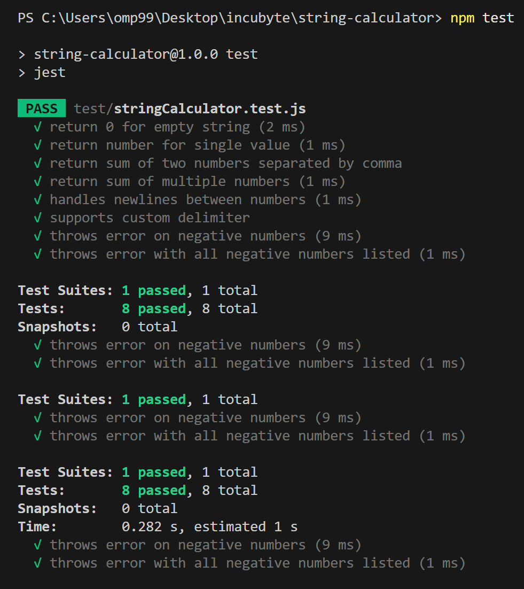
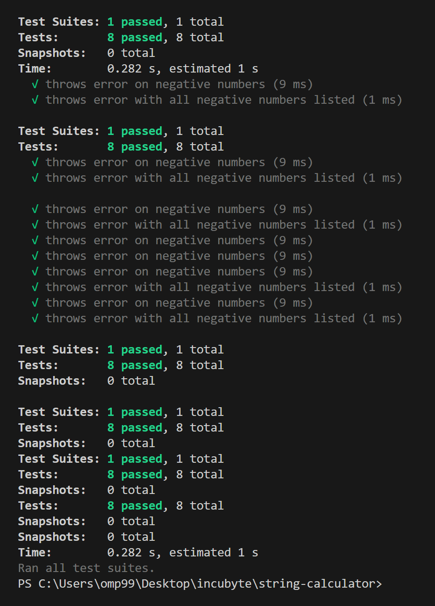

# String Calculator

A JavaScript implementation of the String Calculator kata demonstrating test-driven development (TDD) practices with Jest.

## Overview

The String Calculator parses a string of numbers separated by delimiters and returns their sum. Built using TDD methodology with comprehensive test coverage.

## Supported Formats

```javascript
// Basic operations
add("")                    // → 0
add("1")                   // → 1
add("1,2,3")              // → 6

// Multi-delimiter support
add("1\n2,3")             // → 6

// Custom delimiter syntax
add("//;\n1;2;3")         // → 6
add("//*\n1*2*3")         // → 6

// Business rule validation
add("1,-2,3,-4")          // → Error: "negatives not allowed: -2,-4"
```

## Commit Standards

- `feat:` New feature (e.g. custom delimiter logic)
- `fix:` Logic corrections or bug fixes
- `test:` Added/updated test cases
- `docs:` README and screenshot updates
- `refactor:` Non-breaking code improvements
- `chore:` Setup or tooling-related changes

## Quick Start

```bash
npm install
npm test
```

## Test Coverage

- Empty and whitespace inputs
- Single and multiple numbers
- Mixed delimiters (comma + newline)
- Custom delimiter syntax
- Negative number validation
- Edge cases and malformed input

## Implementation

The calculator follows these rules:
1. Returns 0 for empty/blank strings
2. Sums comma or newline-separated numbers
3. Supports custom delimiters: `//[delimiter]\n[numbers]`
4. Rejects negative numbers with descriptive errors
5. Ignores invalid tokens and trailing delimiters

Built with JavaScript and Jest for testing framework.

---

## Screenshots

### Functional Test Coverage



### Negative Number Error Handling



These screenshots confirm that all test cases pass successfully.

---
